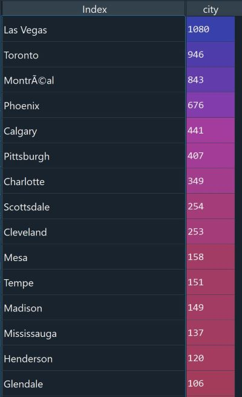
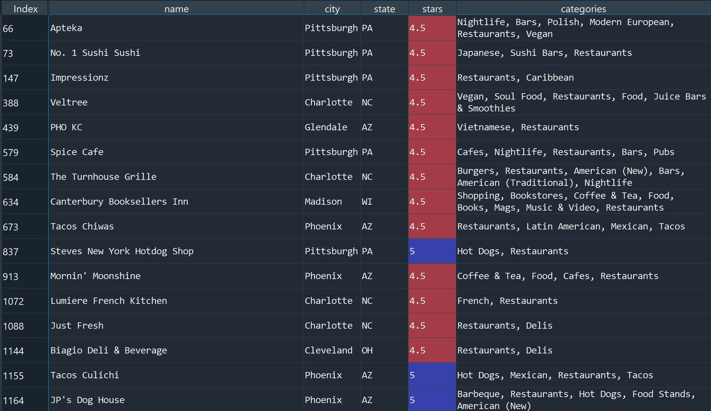
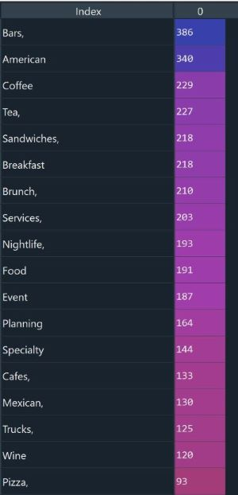

# Restaurant analytics using the YELP dataset
## Challenge: What type of restaurant to open in Cambridge, Massachusetts?

For this challenge, a recommendation has to be made on the type of restaurant that is potentially lucrative in Cambridge, MA.
We will use the YELP dataset for the analysis, however, the dataset **does not** contain information on restaurants in the Massachusetts area.

Therefore, we will look at cities in the YELP dataset that closely resemble Cambridge, MA in terms of population demographics and academic settings

### A little something about Cambridge
According to the 2013 - 2017 American Community Survey, 30.2% of population 18 or older in Cambridge is 
enrolled full-time or part-time in a college or graduate school degree program. In 2017, the median age of all people in Cambridge, MA was 30.4. Native-born citizens, with a median age of 29, were generally younger than than foreign-born citizens, with a median age of 33. But people in Cambridge, MA are getting getting younger. In 2016, the average age of all Cambridge, MA residents was 31.

Since the OG Yelp dataset contains other business vendors (shopping, salons, dental clinics), a "Restaurants"-only dataset was created as a subset of the original dataset

For the analysis, it was required that we needed a list of restaurants that did well. So a further filter was added and a subset of dataset was created which contained only restaurants with a rating of 4.5 and above. We will call this dataset TopTierRestaurants

Within this TopTierRestaurant dataset, the cities with the highest number of restaurants are (in descending order): 

 

The median age of cambridge population is around 30 years.

This is the list of the top 15 cities with the highest number of restaurants in the YELP dataset and the median age of their population:

Cities (median age, years)
1. Las Vegas (~38)
2. Toronto (~40)
3. Montreal (~40)
4. Phoenix (~32.9)
5. Calgary (~37)
6. Pittsburgh (~34)
7. Charlotte (~33)
8. Scottsdale (~46)
9. Cleveland (~36)
10. Mesa (~36)
11. Tempe (~29)
12. Madison (~31)
13. Missisauga (~35)
14. Henderson NV (~42)
15. Glendale (~34)

Of these cities, the cities that has similar demographics & academic settings as Cambridge are:

#### Phoenix, Pittsburgh, Charlotte, Cleveland, Mesa, Tempe, Madison, Missisauga, Glendale

A subset of the dataframe containing restaurants only from the above mentioned cities was then created

The 'categories' index is a [list] of descriptive words of each restaurant:

The 'categories' list was unpacked and the frequency of each descriptive item was measured

The image below shows the descriptive words that most commonly occured in this dataset:

Based on these descriptive items:
The types of restaurants that most commonly do well in cities like Cambridge, MA are:

1. Bars
2. American
3. Coffee
4. Tea
5. Sandwiches
6. Breakfast
7. Brunch
8. Nightlife
9. Cafes
10. Mexican

We can broadly classify the 10 items into 3 types of restaurants:

1. Bars
2. Breakfast/ Brunch places that serve hot beverages (tea, coffee) and sandwiches
3. Mexican 

The findings reveal that the above mentioned three types of restaurants have a good chance of fairing well in a city like Cambridge, MA
